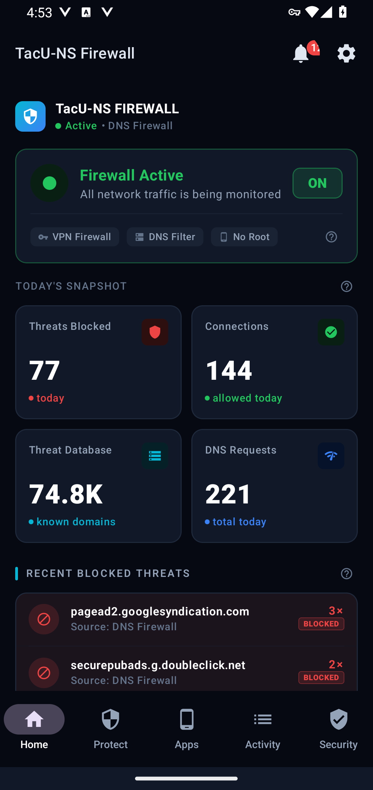
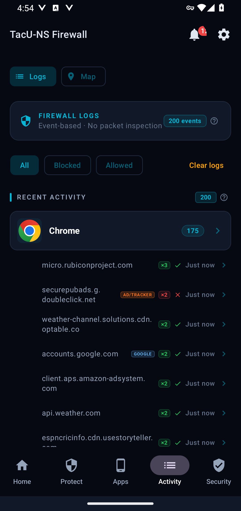
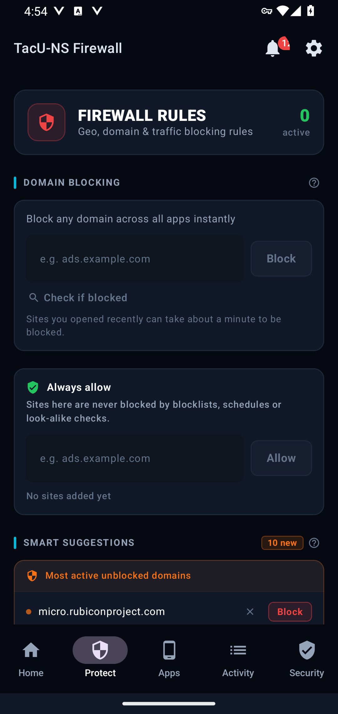
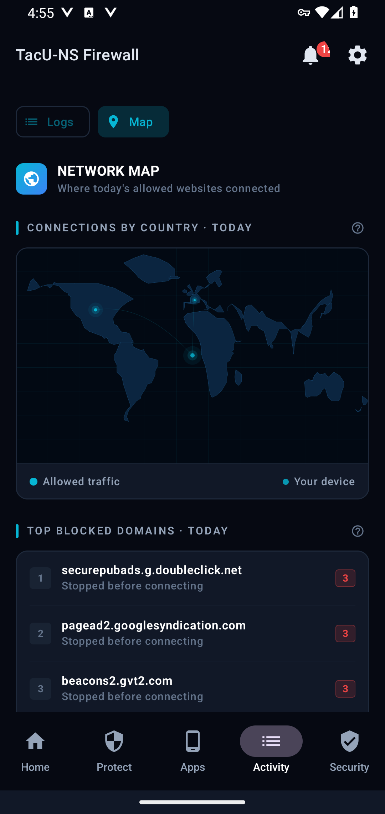
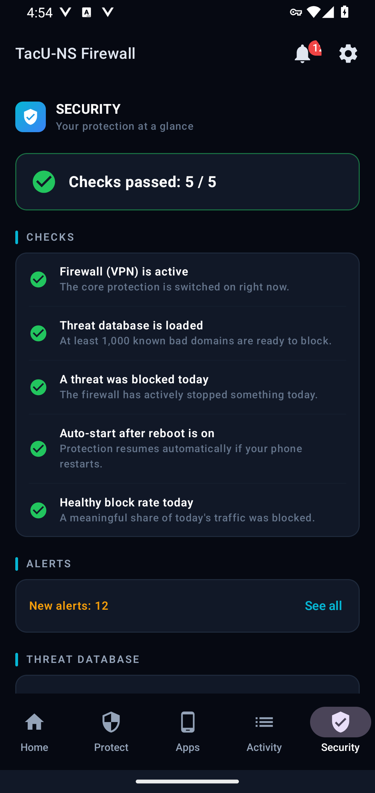

# TacUNS Personal Firewall

[](https://developer.android.com/about/versions/10)
[](https://kotlinlang.org/)
[](LICENSE)
[](https://play.google.com/store/apps/details?id=com.tacu.nsfwzerotrust)

**An open-source Android firewall and DNS firewall.** Block ads, trackers, harmful websites and
any app — right on your phone, with no root, no account and no remote VPN server.

**[Download on Google Play](https://play.google.com/store/apps/details?id=com.tacu.nsfwzerotrust)** ·
[Website](https://www.tacuns.net) ·
[Privacy policy](https://www.tacuns.net/apps/tacuns-firewall/privacy-policy) ·
[Report a security issue](SECURITY.md)

<p>
  
  
  
  
  
</p>

*Screenshots of the app running on the Android emulator with real browsing.*

## Why TacUNS?

- **Runs entirely on your phone.** It uses Android's `VpnService` to make a *local* tunnel —
  your traffic is not sent to a VPN server, and there is no TacUNS server in the middle.
- **No account, no analytics, no ads.** Your rules, settings and activity log stay on the phone.
- **No root needed.** Works on a normal Android 10+ phone.
- **Open source** under the Apache License 2.0 — read exactly what it does.
- **Honest about limits.** What a DNS firewall can and cannot do is written down below.

## Key features

- **Block ads, trackers and harmful websites in every app** — a downloadable ad/tracker
  blocklist (StevenBlack hosts), plus up to 3 blocklists of your own.
- **Block any app** on Wi-Fi, on mobile data, or both.
- **See what every app connects to** — an activity log with a plain-language reason for each
  block, Allow/Block with Undo, and a map of where allowed websites connect.
- **Your own rules** — block any website (a rule for `example.com` also covers
  `www.example.com`), an *Always allow* list, country blocking and a blocking schedule.
- **Extra protection** — look-alike (typosquatting) site warnings and blocking, Safe Search for
  Google / Bing / DuckDuckGo, YouTube restricted mode, one-tap protection levels
  (Normal / Strict / Kids), and a watch-only mode that reports without blocking.
- **Your DNS choice** — Google, Cloudflare, the network's own servers or a custom server, with an
  optional backup server.
- **Security tab, alerts and change history**, App Lock (salted PBKDF2-SHA256, 600,000
  iterations), backup / restore, and 14 languages.

## Project status

Actively developed. Source version **1.2.4**. The official, signed build is on
[Google Play](https://play.google.com/store/apps/details?id=com.tacu.nsfwzerotrust).

## How it works

TacUNS uses Android's [`VpnService`](https://developer.android.com/reference/android/net/VpnService)
to create a local tunnel on the phone — no remote VPN server is involved.

1. The phone's DNS server is set to an address inside the tunnel (`10.0.0.1`), so website
   look-ups reach the firewall first (`SentinelVpnService`, `DnsInterceptor`).
2. The app that made the look-up is identified with Android's `getConnectionOwnerUid`
   (`SessionManager`).
3. The rules decide (`RuleEngine`, `DomainCheck`): *Always allow* wins, then your own rules,
   then the blocklists.
4. Blocked names get a "does not exist" (NXDOMAIN) answer; allowed look-ups are sent to the DNS
   server you chose, by its address (`DnsForwarder`).
5. When at least one app is blocked, the tunnel also carries that app's traffic so it can be
   cut completely.
6. Each decision is written to the on-device activity log (`LogManager`), which you can keep
   for 6 hours to 30 days, or switch off.

The app UI and the firewall run in two processes; they share state only through the on-device
databases and a small options file.

## Known limitations

These come from how a DNS-based, no-root firewall works on Android:

- It filters **DNS look-ups**. An app that connects to a server by a fixed IP address, or that
  uses its own encrypted DNS, is not filtered by name.
- Blocklist entries match the **exact name only**; your own rules also cover sub-names.
- While at least one app is blocked, website blocking applies only to the blocked apps
  (Android allows one VPN tunnel and the routing has to choose).
- Android "Private DNS" in strict mode cannot be combined with the firewall; the app warns
  you when it is on.
- The tunnel is IPv4-only; Android blocks IPv6 traffic of apps that use the tunnel, so they
  fall back to IPv4.

## Privacy

- Rules, settings and the activity log stay on the phone and are excluded from Android cloud
  backup and device-to-device transfer.
- Network connections made by the app: DNS look-ups to the DNS server you chose (the map's
  country look-ups go the same way), and blocklist downloads from their public addresses.
- Backups are saved to the Downloads folder. The activity history is only added when you
  tick "Include activity history".
- No account, no analytics, no ads.
- Privacy policy: https://www.tacuns.net/apps/tacuns-firewall/privacy-policy

## FAQ

**Is this a VPN? Does my traffic go to a server?**
It uses Android's VPN feature only to build a tunnel *on the phone*. Website look-ups pass
through the firewall on your device; nothing is sent to a TacUNS server. Allowed look-ups go to
the DNS server you choose (for example Google or Cloudflare).

**What is DNS filtering?**
Before an app connects to a website, the phone asks for the website's address. TacUNS answers
that question itself for blocked names ("does not exist"), so the connection never starts.

**Do I need root?**
No. It works on a normal Android 10 or newer phone.

**Can I use it together with another VPN app?**
No. Android allows only one VPN connection at a time, so turning on another VPN app turns
TacUNS off.

**What can it not block?**
Apps that connect by a fixed IP address or use their own encrypted DNS — see
[Known limitations](#known-limitations).

**What data does it keep?**
Only what is listed under [Privacy](#privacy), and only on your phone.

## Building

Requirements: JDK 17, Android SDK with platform 36.

```
./gradlew assembleDebug          # debug APK
./gradlew testDebugUnitTest      # unit tests
```

Create `local.properties` with your SDK path (`sdk.dir=...`) if Android Studio has not done it.
Release builds are not signed by this project's Gradle files; sign them with your own key.

## Links

- Download: [Google Play](https://play.google.com/store/apps/details?id=com.tacu.nsfwzerotrust)
- Website: https://www.tacuns.net
- Privacy policy: https://www.tacuns.net/apps/tacuns-firewall/privacy-policy
- Security reports: [SECURITY.md](SECURITY.md)
- Contributing: [CONTRIBUTING.md](CONTRIBUTING.md) · [Code of Conduct](CODE_OF_CONDUCT.md)

## Licence

Apache License 2.0 — see [LICENSE](LICENSE) and [NOTICE](NOTICE).

The licence covers the source code. It does **not** grant permission to use the TacUNS name or
logo (Apache License 2.0, section 6). If you publish a modified version, please use your own
name and icon.
